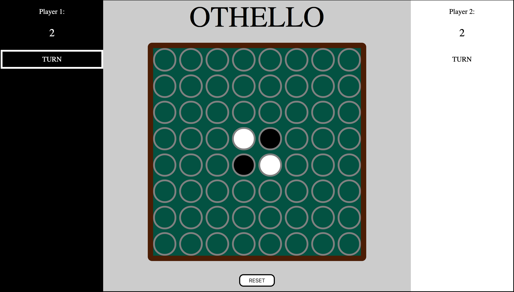

# Othello
---
### Background Information:
*Othello* (also known as *Reversi*) is a classic board game that employs abstract strategy. The origins of *Othello* are unclear, but its most recent history is traced back to Lewis Waterman and John W. Mollett who popularized the game some time in the 1880's. Since then, a Japanese salesman by the name of Goro Hasegawa patented a modern rule-set in 1971; this version is still used today and remains the standard for international tournaments. Half of this modernization was initializing the board with 4 pieces (2 from each player) in a diagonal pattern; the other was shedding the old name of *Reversi* and adopting *Othello* instead.
---
### Screenshots:

---
### Technologies Used:
- JavaScript
- CSS
- HTML
---
### Getting Started:
Link to deployed [game](https://pages.git.generalassemb.ly/chung972/SEI-Project-1/).

The Rules:
1. Black has the first move
2. To make a **LEGAL** move, you **MUST** capture an enemy piece (will also be referred to as chip)
3. To **CAPTURE** an enemy piece, you must place your **OWN** chip between an **ENEMY** chip and **ANOTHER** of your own chips;\
this can be done in any direction: N, NE, E, SE, S, SW, W, NW;\
capturing an enemy chip will **CONVERT** that piece to the captor's color
4. As long as you are **UNABLE** to make a **LEGAL MOVE** (i.e. capture an enemy chip), your turn will be **FORFEITED**
5. If **BOTH** players are unable to make a legal move, then the game ends
6. If there are no more empty tiles, the game also ends
7. The winner is determined by whichever player has the most chips at the end of the game
---
### Next Steps:
- [ ] Create and append elements representing captured chips that will dynamically grow/shrink based on the app state
- [ ] Squash edge case bugs (where conversions occur when they should and shouldn't)
- [ ] Incorporate Responsive Web Design
